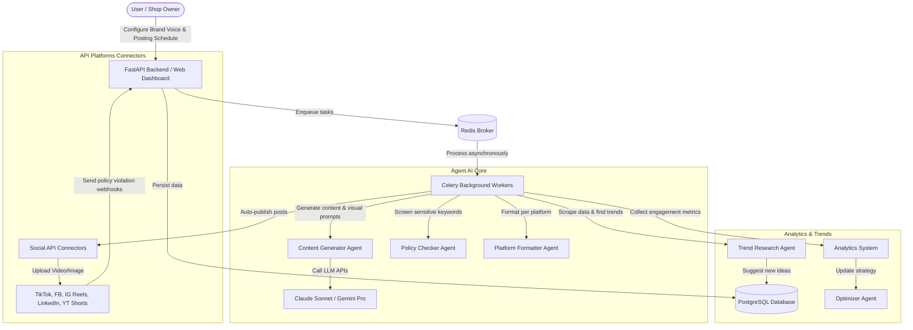

# PROJECT FEATURE IMPLEMENTATION STRATEGY
## AI CONTENT AUTOMATION SYSTEM

This document presents the technology strategy, development roadmap, and detailed system design for implementing the features described in [Business_Analysis.md](./Business_Analysis.md).

---

## 1. System Architecture Overview

The system follows an **Event-Driven & Microservices** model to ensure high scalability and asynchronous handling of heavy tasks (such as AI content generation, media processing, and publishing posts via third-party APIs).



---

## 2. Database Schema Design

We propose using the **PostgreSQL** relational database to manage the system's entities. The detailed table structure is below:

### Table `brand_personas`
Stores the user's brand configuration.
```sql
CREATE TABLE brand_personas (
    id UUID PRIMARY KEY DEFAULT gen_random_uuid(),
    user_id VARCHAR(100) NOT NULL,
    industry VARCHAR(100) NOT NULL,
    tone VARCHAR(100) NOT NULL,
    target_audience TEXT NOT NULL,
    goals TEXT[] NOT NULL, -- Array of content goals
    platforms VARCHAR(50)[] NOT NULL, -- List of connected platforms
    posting_frequency VARCHAR(50) NOT NULL,
    preferred_hours TIME[] NOT NULL,
    created_at TIMESTAMP WITH TIME ZONE DEFAULT CURRENT_TIMESTAMP,
    updated_at TIMESTAMP WITH TIME ZONE DEFAULT CURRENT_TIMESTAMP
);
```

### Table `content_drafts`
Stores AI-generated draft content.
```sql
CREATE TABLE content_drafts (
    id UUID PRIMARY KEY DEFAULT gen_random_uuid(),
    persona_id UUID REFERENCES brand_personas(id) ON DELETE CASCADE,
    idea TEXT NOT NULL,
    script TEXT NOT NULL,
    caption TEXT NOT NULL,
    hashtags VARCHAR(100)[] NOT NULL,
    media_prompt TEXT,
    media_url TEXT, -- Link to the generated/uploaded image or video file
    cta TEXT,
    status VARCHAR(30) DEFAULT 'Draft', -- Draft, Need Review, Approved
    created_at TIMESTAMP WITH TIME ZONE DEFAULT CURRENT_TIMESTAMP
);
```

### Table `scheduled_posts`
Manages the posting schedule and publishing status per platform.
```sql
CREATE TABLE scheduled_posts (
    id UUID PRIMARY KEY DEFAULT gen_random_uuid(),
    draft_id UUID REFERENCES content_drafts(id) ON DELETE CASCADE,
    platform VARCHAR(50) NOT NULL,
    media_spec TEXT NOT NULL,
    formatted_caption TEXT NOT NULL,
    formatted_hashtags VARCHAR(100)[] NOT NULL,
    scheduled_time TIMESTAMP WITH TIME ZONE NOT NULL,
    status VARCHAR(30) DEFAULT 'Scheduled', -- Scheduled, Posting, Posted, Failed, Policy Violated
    external_post_id VARCHAR(255), -- Post ID returned by TikTok, FB, etc.
    external_url TEXT, -- Link to the post after successful publishing
    error_message TEXT, -- Error details if publishing fails
    created_at TIMESTAMP WITH TIME ZONE DEFAULT CURRENT_TIMESTAMP,
    updated_at TIMESTAMP WITH TIME ZONE DEFAULT CURRENT_TIMESTAMP
);
```

### Table `post_metrics`
Stores post performance metrics over time.
```sql
CREATE TABLE post_metrics (
    id UUID PRIMARY KEY DEFAULT gen_random_uuid(),
    post_id UUID REFERENCES scheduled_posts(id) ON DELETE CASCADE,
    views INT DEFAULT 0,
    likes INT DEFAULT 0,
    comments INT DEFAULT 0,
    shares INT DEFAULT 0,
    saves INT DEFAULT 0,
    ctr NUMERIC(5, 4) DEFAULT 0.0000,
    conversion_rate NUMERIC(5, 4) DEFAULT 0.0000,
    collected_at TIMESTAMP WITH TIME ZONE DEFAULT CURRENT_TIMESTAMP
);
```

---

## 3. Implementation Roadmap

We divide the project delivery into **4 main phases**:

### Phase 1: Core Logic Foundation & MVP (Weeks 1–3)
* **Goal:** Build the core backend that lets users define a Brand Persona and triggers the Agent AI to generate raw content.
* **Implementation steps:**
  1. Set up the project environment with `uv` to manage Python 3.10 and configure `pyproject.toml`.
  2. Develop the Brand Persona configuration API for users.
  3. Integrate the OpenAI SDK / Anthropic SDK to call LLMs (using advanced prompt engineering) to generate content drafts based on the Brand Voice.
  4. Implement an internal policy filter (Local Policy Filter) to scan for sensitive keywords and tag risky posts as `Need Review`.

### Phase 2: Platform API Integration & Post Scheduling (Weeks 4–7)
* **Goal:** Connect the official social media platform APIs and the automatic scheduling system.
* **Implementation steps:**
  1. Implement the OAuth 2.0 flow so users can connect TikTok Business, Facebook Pages, Instagram Graph, and LinkedIn Organization accounts.
  2. Write API connectors for publishing posts (using chunked upload for large video files on TikTok and Facebook).
  3. Set up Redis and Celery Beat as the periodic task queue, continuously checking the database to publish `Scheduled` posts when their golden hour arrives.
  4. Build a webhook endpoint to receive platform policy violation notifications (e.g., Facebook Webhooks for Page Policy Violations), automatically set the post status to `Policy Violated`, and alert the admin.

### Phase 3: AI Trend Research & Social Listening (Weeks 8–10)
* **Goal:** The AI automatically detects industry trends and proactively converts them into content ideas.
* **Implementation steps:**
  1. Build a data collection service for hot keywords from Google Trends, the TikTok Trend Discovery API, and Twitter/X Search.
  2. Develop a trend-relevance filtering algorithm using embedding models / a vector database (such as ChromaDB or pgvector).
  3. Design the agent flow that proposes content ideas based on newly discovered trends and adds them to the user's approval queue.

### Phase 4: Closed-Loop Optimization (Weeks 11–12)
* **Goal:** The AI automatically learns from real performance data to improve content quality in the next cycle.
* **Implementation steps:**
  1. Build a periodic task that scans and collects metrics for published posts (views, likes, shares, CTR) at 24h, 48h, and 7d.
  2. Develop the Optimizer algorithm: analyze which tone, time slot, and hashtags yield the highest CTR.
  3. Build a dynamic Prompt Tuning mechanism: the system automatically appends these lessons learned to the Content Generator's System Prompt for the next content generation run.

---

## 4. Exception Handling & Security Strategy

### A. Secure Token Management
* **Problem:** Platform API tokens (especially Facebook Page Tokens) typically expire after 60 days or when the user changes their password.
* **Strategy:**
  * Store tokens encrypted in the database using **AES-256**.
  * Use an automatic token renewal mechanism via **Refresh Token**, running in the background before the main token expires.
  * If the Refresh Token has expired, immediately move future posts to `Failed` due to the connection error and send an email/push notification asking the user to reconnect their account.

### B. Automatic Retry Policy
* **Problem:** Social media APIs occasionally suffer transient failures or network congestion.
* **Strategy:**
  * Use Celery's retry configuration with an **Exponential Backoff** strategy (retry after 5 minutes, 15 minutes, then 30 minutes — maximum 3 attempts).
  * Only retry on network errors or platform-side system errors (HTTP 5xx). Do not retry on authentication errors (401) or invalid-data errors (400) to avoid wasting resources.

---

## 5. Recommended Tech Stack

| Component | Chosen technology | Rationale |
| --- | --- | --- |
| **Programming language** | Python 3.10 | Best support for AI/ML libraries and strong type-hinting features. |
| **Package Manager** | `uv` | 10–100× faster dependency installation than pip/poetry, with solid virtual environment management. |
| **Backend Framework** | FastAPI | Very fast execution, async/await support, and automatic Swagger API documentation. |
| **Database** | PostgreSQL | Strong relational data support, array/JSONB storage, and good AI extensibility via pgvector. |
| **Task Queue** | Celery + Redis | Accurate post scheduling and good load handling by distributing tasks across background workers. |
| **AI LLM API** | Claude 3.5 Sonnet / Gemini 1.5 Pro | Claude produces the most natural creative scripts; Gemini's large context window suits long video processing. |
